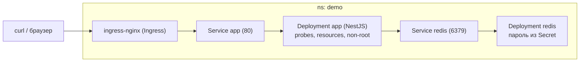
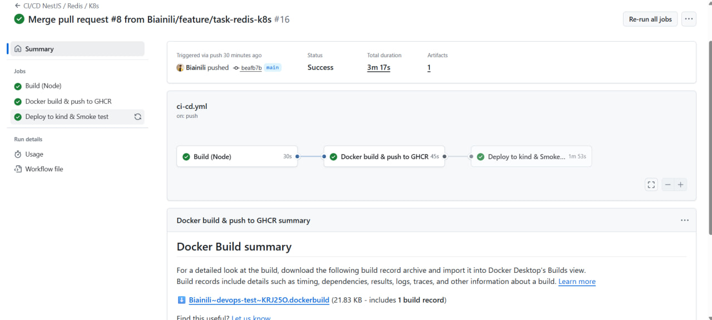
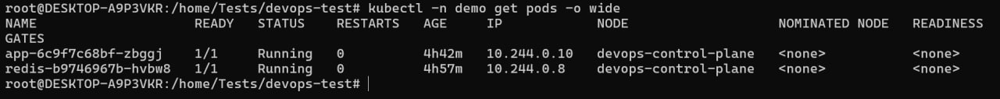
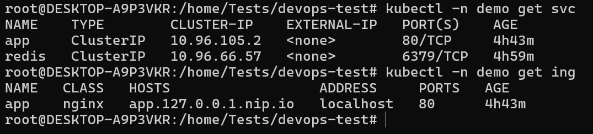
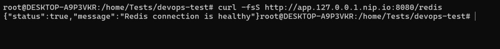
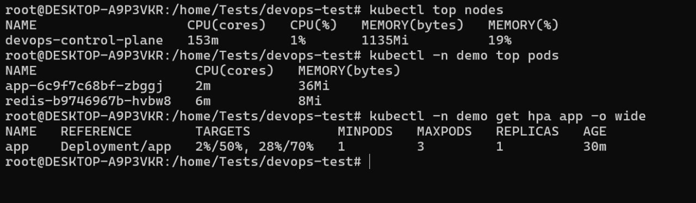
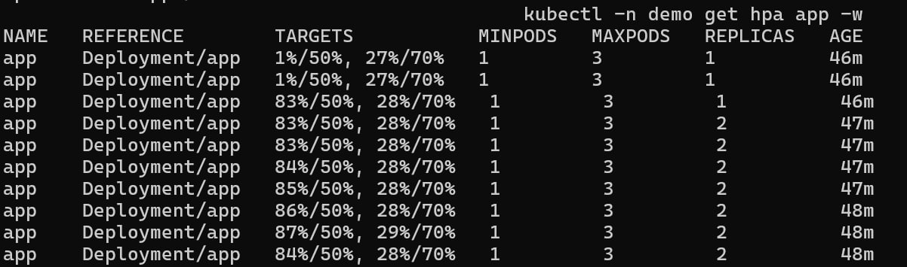
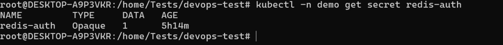

# DevOps тестовое — CI/CD для NestJS + Redis + Kubernetes

Оптимизированный **multi‑stage Dockerfile**, **GitHub Actions** (build → push в **GHCR** → деплой в **kind** → smoke‑тест), **Kubernetes**‑манифесты (App + Redis + Ingress + Secret + ConfigMap + HPA), базовая безопасность. Всё воспроизводимо локально.

**Репозиторий:** https://github.com/Biainili/devops-test  
**Образ (GHCR):** `ghcr.io/biainili/devops-test:latest`

---

## Архитектура



**Эндпоинт:** `GET /redis`  →  `{"status": true|false, "message": "..."}`

---

## Что сделано

- **Dockerfile**: многоэтапный `node:20-alpine`, минимальный runtime‑слой, `USER node`, корректный `.dockerignore`.
- **CI/CD (GitHub Actions)**: сборка → публикация в **GHCR** → деплой в **kind** → `curl /redis` (smoke).
- **Kubernetes**:
  - **App**: `Deployment` / `Service` / `Ingress` / `ConfigMap` (liveness/readiness, requests/limits).
  - **Redis**: `Deployment` / `Service`; пароль — в `Secret`.
  - **HPA** (`autoscaling/v2`): CPU **50%**, Memory **70%**, **1..3** реплик.
  - **metrics-server** для метрик.
  - **NetworkPolicy** — ограничение доступа к Redis.
- **Безопасность**: `runAsNonRoot`, `allowPrivilegeEscalation: false`, `capabilities: drop ["ALL"]`.

---

## Проверка локально (kind)

**Требуется**: Docker, `kubectl`, `kind`.

```
kind create cluster --config k8s/infra/kind-config.yaml

kubectl apply -f https://raw.githubusercontent.com/kubernetes/ingress-nginx/controller-v1.10.1/deploy/static/provider/kind/deploy.yaml

# помечаем ноду для ingress (имя ноды из kind; в примере — devops-control-plane)
kubectl label node devops-control-plane ingress-ready=true --overwrite

kubectl create ns demo

kubectl -n demo create secret generic redis-auth --from-literal=password="DevOps123456"

kubectl -n demo apply -f k8s/

# smoke-тест эндпоинта (kind по конфигу 80->8080):
curl -fsS http://app.127.0.0.1.nip.io:8080/redis
```

> `*.nip.io` автоматически резолвится на `127.0.0.1`, поэтому домен работает без дополнительной DNS‑настройки.

**Удаление (опционально):**
```
kubectl delete ns demo --ignore-not-found
kind delete cluster
```

---

## CI/CD (GitHub Actions → GHCR)

**Workflow:** `.github/workflows/ci-cd.yml`  
Этапы: **Build (Node)** → **Docker build & push (GHCR)** → **Deploy to kind** → **Smoke `/redis`**.



---

## Скриншоты проверки

- Поды: 
- Сервисы и Ingress: 
- Smoke `/redis`: 
- Метрики и HPA: 
- Масштабирование HPA: 
- Наличие Secret (пароль Redis): 

---

## Структура репозитория

```
.github/workflows/ci-cd.yml
k8s/
  app-configmap.yaml
  app-deployment.yaml
  app-service.yaml
  app-ingress.yaml
  app-hpa.yaml
  redis-deployment.yaml
  redis-service.yaml
  redis-networkpolicy.yaml
  infra/kind-config.yaml
Dockerfile
.dockerignore
docs/*.png
src/…
```

---


